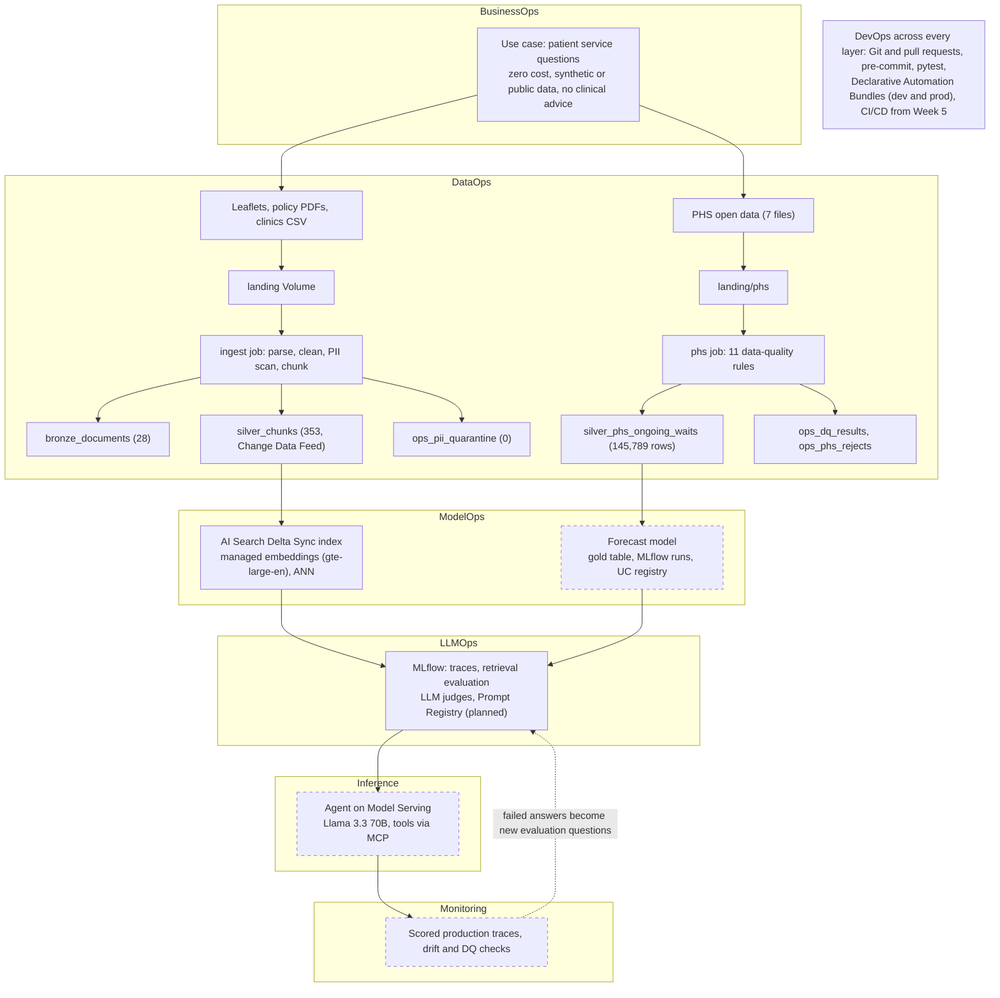

# CareConnect Navigator

[](https://github.com/dmishra27/careconnect-navigator/actions/workflows/ci.yml)

A healthcare LLMOps and MLOps portfolio project on Databricks. It builds an assistant that answers
patients' questions about NHS hospital services, grounded in service leaflets and Scottish
Government policy, with the source and page cited for every answer. A second track turns Public
Health Scotland waiting-times statistics into clean, checked data for a forecasting model.

The project runs on **Databricks Free Edition** from a laptop at no cost, following the Maven course
[LLMOps with Databricks](https://maven.com/cauchy/llmops-with-databricks) self-paced.

**Status (10 October 2026):** Weeks 1 and 2 of 7 complete. The knowledge base is built, indexed and
measured; answer generation and the agent start in Week 3.

## The problem

Patients ask the same questions again and again: how to change an appointment, how long the wait
will be, how to get to a clinic, how to complain, how to see their records. The answers sit across
dozens of leaflets and long policy PDFs, some of them out of date. CareConnect Navigator aims to:

- answer in plain language, using only current guidance, and cite the document, section and page;
- never show superseded guidance;
- look up clinics and the latest published waiting times;
- be operated like a production system: versioned, tested, traced, evaluated and monitored.

It covers services and patient rights, not medical advice. **All data is synthetic or public; no
real patient data is used.**

## Architecture

Two tracks share one governed Databricks platform, are measured in one MLflow experiment, and meet
at the agent. Solid boxes are built; dashed boxes are planned.



| Layer | What it does here |
| --- | --- |
| BusinessOps | Use case, users and limits: no cost, no real patient data, no clinical advice |
| DataOps | Files land in a Unity Catalog Volume, then bronze, silver and ops Delta tables; documents pass a PII scan, PHS rows pass data-quality rules |
| ModelOps | AI Search index follows `silver_chunks` through Change Data Feed; forecast model to be trained and registered |
| LLMOps | Retrieval measured before any agent uses it; LLM judges, versioned prompts and a registered agent next |
| Inference | Agent and forecast model on Model Serving; agent tools for search, clinic lookup and PHS waits |
| Monitoring | Production traces scored on a schedule; failures fed back into the evaluation set |
| DevOps | One repo, bundle-defined resources, tests and hooks on every commit, pull requests to `main` |

## Results so far

**Retrieval quality.** 46 patient-style questions, each labelled with the document and an evidence
phrase that must appear in the retrieved passage. Index of 353 chunks, 10 October 2026:

| Search method | Recall@1 | Recall@5 | Recall@10 | MRR | Document recall@5 |
| --- | --- | --- | --- | --- | --- |
| **ANN (vector, default)** | **0.783** | **0.891** | **0.957** | **0.828** | **0.978** |
| Hybrid | 0.609 | 0.826 | 0.848 | 0.688 | 0.913 |
| Full text | 0.326 | 0.609 | 0.696 | 0.438 | 0.739 |

**Chunk size.** 400 tokens with 60 overlap was kept: 800/120 scored the same (MRR 0.788 vs 0.787)
but sends about 40% more text to the model, and 200/40 scored lower (MRR 0.722).

**Waiting-times data.** 145,789 rows from October 2012 to June 2026, 0 rows rejected. In June 2026,
157,191 inpatients were waiting in Scotland (62.8% over 12 weeks) and 496,349 outpatients (50.7% over
12 weeks).

**Engineering.** 84 unit tests and 2 integration tests, with lint and unit tests run by GitHub Actions on every pull request; two serverless jobs (`ingest_job`,
`phs_job`) deployed by the bundle; 4 decision records.

## Data sources

| Source | Use | Licence |
| --- | --- | --- |
| 22 synthetic leaflets for the fictional Firth Valley Health Board (one deliberately superseded) and a clinics CSV | Knowledge base, clinic lookup | CC0-1.0, written for this project |
| 6 Scottish Government, SPSO and legislation.gov.uk documents on patient rights, waiting times and complaints | Knowledge base | Open Government Licence v3.0 (SPSO: publisher's terms) |
| Public Health Scotland, Stage of Treatment Ongoing Waits (long trend) and 6 lookup files | Waiting-times track | Open Government Licence |

PDFs and PHS CSVs are not stored in Git; `data/raw/policies/sources.csv` and `data/raw/phs/README.md`
record where each comes from.

## Tech stack

| Area | Tools |
| --- | --- |
| Platform | Databricks Free Edition (serverless), Unity Catalog, Volumes, Delta Lake |
| Pipelines and deployment | Lakeflow Jobs, Declarative Automation Bundles, Databricks CLI |
| Retrieval and models | AI Search (Delta Sync index), Foundation Model APIs (`databricks-gte-large-en`, Llama 3.3 70B, Llama 3.1 8B) |
| Tracking and evaluation | MLflow 3 (tracing, evaluation runs) |
| Python | Python 3.12, uv, databricks-sdk, databricks-connect, pypdf, pandas, pydantic |
| Quality | Ruff, pre-commit, pytest |

## Repository layout

```text
careconnect-navigator/
├── databricks.yml            # bundle: dev and prod targets
├── resources/                # schemas, Volume, ingest_job, phs_job
├── project_config.yml        # per-environment settings (catalog, schema, endpoints)
├── src/careconnect/
│   ├── ingest/               # parsing, PII scan, chunking, Delta writes
│   ├── search/               # AI Search endpoint, index and retriever
│   ├── evals/                # retrieval evaluation logged to MLflow
│   └── phs/                  # PHS download, transform, data-quality rules
├── data/
│   ├── raw/                  # leaflets, clinics, source manifests
│   └── eval/                 # retrieval_questions.yml
├── scripts/                  # quick checks (connection, ingest, LLM call)
├── tests/                    # unit tests; integration tests marked `integration`
└── docs/                     # weekly reports and decision records
```

## How to run

You need a Databricks workspace (Free Edition works), the
[Databricks CLI](https://docs.databricks.com/dev-tools/cli/install), [uv](https://docs.astral.sh/uv/)
and Python 3.12. Commands below are for PowerShell; they work the same in bash.

```powershell
# 1. Sign in and install
databricks auth login --host https://<your-workspace>.cloud.databricks.com
uv sync

# 2. Create the schema, Volume and jobs
databricks bundle deploy -t dev

# 3. Upload the source documents (download the policy PDFs listed in
#    data/raw/policies/sources.csv into data/raw/policies first)
databricks fs cp -r data/raw/leaflets  dbfs:/Volumes/workspace/careconnect_dev/landing/leaflets
databricks fs cp -r data/raw/policies  dbfs:/Volumes/workspace/careconnect_dev/landing/policies
databricks fs cp -r data/raw/reference dbfs:/Volumes/workspace/careconnect_dev/landing/reference

# 4. Build the knowledge base and search index
uv run ingest --env dev
uv run build-index --env dev        # first build takes about 25 minutes

# 5. Try a search and measure retrieval quality
uv run python -m careconnect.search.retriever "How do I complain?"
uv run python -m careconnect.evals.retrieval --env dev --mode index

# 6. Waiting-times data (download on the laptop: serverless jobs have no internet access)
uv run phs --env dev --download

# Or run the deployed jobs
databricks bundle run ingest_job -t dev
databricks bundle run phs_job -t dev

# Tests
uv run pytest -m "not integration"
```

## Documentation

- [Week 1 report](docs/week1_report.md): workspace, CLI, first traced LLM call, bundle, tooling
- [Week 2 report](docs/week2_report.md): ingestion, search index, retrieval evaluation, PHS
  pipeline, experiment log and findings
- [Week 2 summary](docs/week2.md)
- [Decision records](docs/decisions/): workspace layout, retrieval query type and chunk size, no
  internet on Free Edition jobs, MLflow trace storage
- [Project progress tracker](https://claude.ai/code/artifact/93fe6141-72c6-4c91-9ea3-47d1c7581c25):
  goals, roadmap, step-by-step status, architecture

## Roadmap

| Week | Focus | Status |
| --- | --- | --- |
| 1 | Foundations: workspace, CLI, traced LLM call, bundle, tooling | Done |
| 2 | Data and knowledge processing: ingest, search index, retrieval evaluation, PHS data quality | Done |
| 3 | Answers with citations, LLM-judge evaluation, gold table and first forecast | Next |
| 4 | Agent with tools and MCP, Prompt Registry, models in Unity Catalog | Planned |
| 5 | Model Serving, CI/CD with GitHub Actions | Planned |
| 6 | Monitoring and feedback loop | Planned |
| 7 | Production deployment and write-up | Planned |

Weeks 3 to 7 follow the course overview; the order may change as the course publishes its topics.
